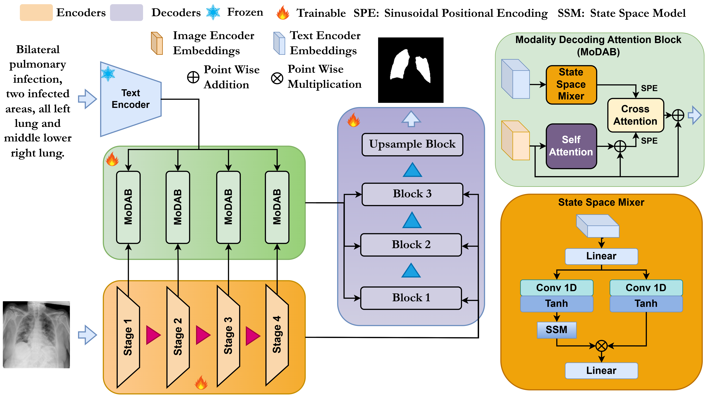

# UA-VLS: Uncertainty-Aware Vision-Language Segmentation for Medical Imaging [WACV 2026]



## Abstract

We introduce a novel uncertainty-aware multimodal segmentation framework that leverages both radiological images and associated clinical text for precise medical diagnosis. We propose a Modality Decoding Attention Block (MoDAB) with a lightweight State Space Mixer (SSMix) to enable efficient cross-modal fusion and long-range dependency modelling. To guide learning under ambiguity, we propose the Spectral-Entropic Uncertainty (SEU) Loss, which jointly captures spatial overlap, spectral consistency, and predictive uncertainty in a unified objective. In complex clinical circumstances with poor image quality, this formulation improves model reliability. Extensive experiments on various publicly available medical datasets, QATA-COVID19, MosMed++, and Kvasir-SEG, demonstrate that our method achieves superior segmentation performance while being significantly more computationally efficient than existing State-of-the-Art (SoTA) approaches. Our results highlight the importance of incorporating uncertainty modelling and structured modality alignment in vision-language medical segmentation tasks.

## Table of Contents

- [Requirements](#requirements)
- [Dataset Setup](#dataset-setup)
- [How to Run](#how-to-run)
- [How to Evaluate](#how-to-evaluate)
- [Citation](#citation)


## Project Structure

```
UA-VLS/
├── train.py                    # Training script
├── evaluate.py                 # Evaluation script
├── config/
│   └── training.yaml          # Configuration file
├── engine/
│   ├── wrapper.py             # PyTorch Lightning wrapper
│   └── loss.py                # Loss functions (SEU Loss)
├── utils/
│   ├── config.py              # Configuration parser
│   ├── dataset.py             # Dataset loader (QaTa)
│   ├── model.py               # Main model architecture
│   ├── mamba.py               # Mamba/SSMix components
│   └── layers.py              # Custom layers
├── assets/
│   └── figure.png             # Model architecture figure
└── README.md                  # This file
```

## Requirements

To run this project, you need Python 3.8+ and the following dependencies.

### Installation

Install all dependencies at once:

```bash
# Using requirements.txt
pip install -r requirements.txt
```

Or install manually:

```bash
# Core deep learning framework
pip install torch torchvision torchaudio

# PyTorch Lightning
pip install pytorch-lightning

# Metrics and evaluation
pip install torchmetrics

# NLP and vision models
pip install transformers

# Medical image processing
pip install monai

# Data processing
pip install pandas openpyxl numpy scipy

# Image processing
pip install Pillow

# Configuration
pip install PyYAML

# Efficient operations
pip install einops

# State Space Models (Mamba) - REQUIRED
pip install mamba-ssm
```

### Key Dependencies:

| Package | Version | Purpose |
|---------|---------|---------|
| **torch** | ≥2.0.0 | Core deep learning framework |
| **pytorch-lightning** | ≥2.0.0 | Training and evaluation pipeline |
| **torchmetrics** | ≥0.11.0 | Evaluation metrics (Dice, IoU, Accuracy) |
| **transformers** | ≥4.30.0 | Hugging Face transformers for BERT and Vision models |
| **monai** | ≥1.2.0 | Medical Imaging library for transforms and losses |
| **mamba-ssm** | ≥1.0.0 | State Space Models for Mamba layers (CRITICAL) |
| **einops** | ≥0.7.0 | Efficient tensor operations (rearrange, repeat) |
| **pandas** | ≥1.5.0 | Data manipulation and CSV/Excel reading |
| **openpyxl** | ≥3.10.0 | Excel file support for dataset metadata |
| **numpy** | ≥1.23.0 | Numerical computations |
| **scipy** | ≥1.10.0 | Scientific computing utilities |
| **Pillow** | ≥9.5.0 | Image processing |
| **PyYAML** | ≥6.0 | YAML configuration file parsing |

### Model-Specific Requirements:

The project uses the following pre-trained models that will be automatically downloaded:

- **BiomedVLP-CXR-BERT-specialized**: Biomedical language model for clinical text encoding
  - Model: `microsoft/BiomedVLP-CXR-BERT-specialized`

- **ConvNeXt-Tiny**: Efficient vision backbone for image feature extraction
  - Model: `facebook/convnext-tiny-224`

These models are automatically downloaded on first use and cached locally.

## Dataset Setup

### Download Datasets

All datasets used in this research can be downloaded from Kaggle:

**[Download from Kaggle](https://www.kaggle.com/datasets/tanishq165/medical-2d)**

The preprocessed datasets include:
- **QATA-COVID19**: COVID-19 chest CT scan segmentation
- **MosMed++**: COVID-19 lung segmentation dataset
- **Kvasir-SEG**: Gastrointestinal polyp segmentation

### Directory Structure

After downloading and extracting the datasets, organize them in the following structure:

```
datasets/
├── Covid19/
│   ├── Train_Folder/
│   │   ├── img/              # Training images
│   │   ├── labelcol/         # Training ground truth masks
│   │   └── Train_text.xlsx   # Training image-text metadata
│   └── Test_Folder/
│       ├── img/              # Test images
│       ├── labelcol/         # Test ground truth masks
│       └── Test_text.xlsx    # Test image-text metadata
├── MosMed/
│   ├── Train_Folder/
│   │   ├── img/
│   │   ├── labelcol/
│   │   └── Train_text.xlsx
│   └── Test_Folder/
│       ├── img/
│       ├── labelcol/
│       └── Test_text.xlsx
├── kvasir_polyp/
│   ├── Train_Folder/
│   │   ├── img/
│   │   ├── labelcol/
│   │   └── Train_text.xlsx
│   └── Test_Folder/
│       ├── img/
│       ├── labelcol/
│       └── Test_text.xlsx
├── MoNuSeg/
│   ├── Train_Folder/
│   │   ├── img/
│   │   ├── labelcol/
│   │   └── Train_text.xlsx
│   └── Test_Folder/
│       ├── img/
│       ├── labelcol/
│       └── Test_text.xlsx
├── clinicdb_polyp/
├── bkai_polyp/
├── busi/
└── ClinicDB/
```

### Dataset Format

Each dataset should have:
- **img/**: Directory containing medical images
- **labelcol/**: Directory containing ground truth segmentation masks
- **{Train,Test}_text.xlsx**: Excel files with two columns:
  - `Image`: Image filename (should match a file in `labelcol/`)
  - `Description`: Clinical text description/caption for the image

## How to Run

### Configuration

Edit `config/training.yaml` to configure training parameters:

```yaml
TRAIN:
  train_batch_size: 32      # Batch size for training
  valid_batch_size: 8       # Batch size for validation/testing
  image_size: [224, 224]    # Input image resolution
  
  lr: 0.0003                # Learning rate (adjust per dataset)
  min_epochs: 20            # Minimum training epochs
  max_epochs: 200           # Maximum training epochs
  patience: 20              # Early stopping patience
  
  device: 1                 # GPU device ID
  model_save_path: RESULTS  # Directory to save model checkpoints
  model_save_filename: UA-VLS

MODEL:
  bert_type: microsoft/BiomedVLP-CXR-BERT-specialized  # Language model
  vision_type: facebook/convnext-tiny-224               # Vision backbone
  project_dim: 768          # Projection dimension for cross-modal fusion

DATA:
  data_name: Covid19        # Dataset name (Covid19, MosMed, kvasir_polyp, etc.)
  train_csv_path: datasets/Covid19/Train_Folder/Train_text.xlsx
  train_root_path: datasets/Covid19/Train_Folder/
  test_csv_path: datasets/Covid19/Test_Folder/Test_text.xlsx
  test_root_path: datasets/Covid19/Test_Folder/
```

### Training

To train the UA-VLS model on a dataset:

```bash
# Train with default configuration
python train.py

# Train with custom config file
python train.py --config ./config/training.yaml
```

**Training Features:**
- Automatic checkpoint saving of the best model based on validation loss
- Test evaluation after each epoch
- Early stopping to prevent overfitting
- Automatic model saving to `RESULTS/{dataset_name}/` directory
- Detailed logging of training, validation, and test metrics

**Output:**
- Best model checkpoint: `RESULTS/{dataset_name}/UA-VLS.ckpt` (based on validation loss)
- Best test model: `RESULTS/{dataset_name}/best_test_model.ckpt` (based on test performance)
- Training logs with epoch-wise metrics (loss, dice, accuracy, IoU)

### Supported Datasets

Simply change the `DATA` section in `config/training.yaml`:

```yaml
# For COVID-19 dataset
DATA:
  data_name: Covid19
  train_csv_path: datasets/Covid19/Train_Folder/Train_text.xlsx
  train_root_path: datasets/Covid19/Train_Folder/
  test_csv_path: datasets/Covid19/Test_Folder/Test_text.xlsx
  test_root_path: datasets/Covid19/Test_Folder/

# For MosMed dataset
DATA:
  data_name: MosMed
  train_csv_path: datasets/MosMed/Train_Folder/Train_text.xlsx
  train_root_path: datasets/MosMed/Train_Folder/
  test_csv_path: datasets/MosMed/Test_Folder/Test_text.xlsx
  test_root_path: datasets/MosMed/Test_Folder/

# For Kvasir-SEG dataset
DATA:
  data_name: kvasir_polyp
  train_csv_path: datasets/kvasir_polyp/Train_Folder/Train_text.xlsx
  train_root_path: datasets/kvasir_polyp/Train_Folder/
  test_csv_path: datasets/kvasir_polyp/Test_Folder/Test_text.xlsx
  test_root_path: datasets/kvasir_polyp/Test_Folder/
```

## How to Evaluate

### Evaluate on Test Set

To evaluate a trained model on the test set:

```bash
python evaluate.py
```

**Before evaluation**, modify the checkpoint path in `evaluate.py`:

```python
# Edit this line in evaluate.py to point to your saved model
checkpoint = torch.load('./save_model/MosMed/best_test_model.ckpt', map_location='cpu')["state_dict"]
```

### Evaluation Metrics

The model is evaluated using the following metrics:

1. **Dice Coefficient**: Measures overlap between predicted and ground truth masks
   - Range: 0-1 (higher is better)
   
2. **Intersection over Union (IoU)**: Also known as Jaccard Index
   - Range: 0-1 (higher is better)
   
3. **Accuracy**: Pixel-wise accuracy
   - Range: 0-1 (higher is better)
   
4. **Loss**: Combined Dice-CrossEntropy loss (or SEU Loss)

### Evaluation Output

The evaluation script will output:

```
Running test after epoch: X
test_loss: 0.1234
test_dice: 0.8765
test_acc: 0.9234
test_MIoU: 0.8456
```

### Custom Evaluation

To evaluate on a specific dataset without full training:

```python
from engine.wrapper import UA_VLSWrapper
from utils.dataset import QaTa
from torch.utils.data import DataLoader
import torch
import pytorch_lightning as pl

# Load configuration
import utils.config as config
args = config.load_cfg_from_cfg_file('./config/training.yaml')

# Create model
model = UA_VLSWrapper(args)

# Load checkpoint
checkpoint = torch.load('./RESULTS/Covid19/UA-VLS.ckpt', map_location='cpu')["state_dict"]
model.load_state_dict(checkpoint, strict=True)

# Create test dataloader
ds_test = QaTa(csv_path=args.test_csv_path,
               root_path=args.test_root_path,
               tokenizer=args.bert_type,
               image_size=args.image_size,
               mode='test')
dl_test = DataLoader(ds_test, batch_size=args.valid_batch_size, shuffle=False, num_workers=8)

# Evaluate
trainer = pl.Trainer(accelerator='gpu', devices=1)
model.eval()
trainer.test(model, dl_test)
```

## Model Architecture

### Key Components:

1. **Vision Encoder**: ConvNeXt-Tiny backbone for extracting image features
2. **Language Encoder**: BiomedVLP-CXR-BERT for processing clinical text descriptions
3. **Modality Decoding Attention Block (MoDAB)**: Cross-modal fusion mechanism
4. **State Space Mixer (SSMix)**: Efficient long-range dependency modeling
5. **Segmentation Head**: Produces binary segmentation masks

### Loss Functions:

- **Dice-CrossEntropy Loss** (default): Combines spatial overlap (Dice) with classification confidence
- **Spectral-Entropic Uncertainty (SEU) Loss**: Jointly captures spatial overlap, spectral consistency, and predictive uncertainty for improved robustness

## Citation

If you use UA-VLS in your research, please cite:

```bibtex
@inproceedings{UAVLS2026,
  title={Uncertainty-Aware Vision-Language Segmentation for Medical Imaging},
  author={Aryan Das, Tanishq Rachamalla, Koushik Biswas, Swalpa Kumar Roy, Vinay Kumar Verma},
  booktitle={Proceedings of the IEEE/CVF Winter Conference on Applications of Computer Vision (WACV)},
  year={2026}
}
```
